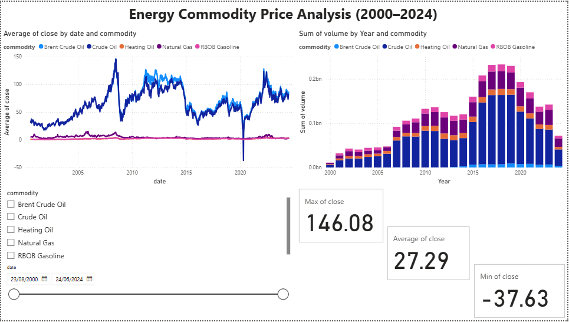
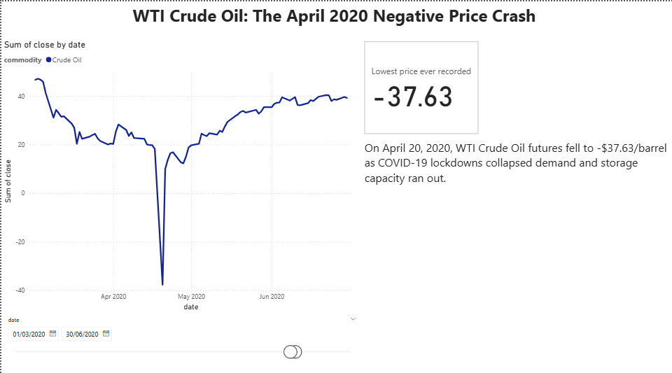

# Energy Commodity Analytics Dashboard

An interactive Power BI dashboard analysing 24 years of daily price data for five major energy commodities (Crude Oil, Brent Crude Oil, Natural Gas, Heating Oil, and RBOB Gasoline), with data cleaning and exploratory analysis done in Python.

## Why I built this

I wanted a project that reflects the kind of work I did during my internship at KMG Parker Drilling (oil and gas sector), where I worked with SQL, Excel, and Power BI to build reports for non-technical stakeholders. This project follows the same workflow: take raw data, clean and explore it in Python, then turn it into an interactive dashboard that someone with no technical background could actually use to understand the data.

## What's in this dataset

- Daily price data (open, high, low, close, volume) for 5 energy commodities
- ~28,000 rows, covering 2000–2024 (Brent Crude Oil only starts from 2007)
- Source: [Oil, Gas & Other Fuels Futures Data](https://www.kaggle.com/datasets/guillemservera/fuels-futures-data) on Kaggle

## Process

### 1. Data cleaning and exploration
Using pandas in a Jupyter notebook, I:
- Checked the data for missing values and duplicates (there were none)
- Converted the date column to a proper datetime format
- Ran summary statistics to understand the distribution of prices and volumes across commodities
- Found and investigated an anomaly: negative oil prices on 20–21 April 2020

This was the most interesting part of the process. My first instinct when I saw negative prices was that it must be a data error, since negative prices don't make sense for a physical commodity. After looking into it, I found it was a real historical event — during COVID lockdowns, demand for oil collapsed so badly that storage was running out, and traders holding futures contracts close to expiry had to pay buyers to take the oil off their hands rather than deal with physical delivery. WTI Crude Oil actually traded as low as -$37.63/barrel on 20 April 2020. I think this is a good example of why it's important to investigate unusual data points rather than just deleting them as "errors."

The full notebook is in `notebooks/01_data_exploration.ipynb`.

### 2. Dashboard - Power BI
The dashboard has two pages:

**Overview** — line chart of closing prices for all five commodities over time, with slicers to filter by commodity and date range, plus KPI cards showing the max, min, and average closing price across the dataset. There's also a volume chart showing trading activity over time, which shows trading volume gradually increasing from 2000 and peaking around 2015–2017.

**2020 Oil Crash** — a dedicated page zoomed into March–June 2020, filtered to Crude Oil only, with an annotation explaining what happened and why. I made this its own page because I think it's the most interesting and explainable finding in the dataset, and it's easier to tell that story on a focused page than buried inside a chart with 24 years of data on it.

## Screenshots





## Tech stack

- **Python** (pandas, numpy, matplotlib) — data cleaning and exploratory analysis
- **Jupyter Notebook** — for the analysis workflow
- **Power BI Desktop** — interactive dashboard

## Project structure

```
energy-analytics-dashboard/
├── data/
│   ├── raw/                  # original dataset from Kaggle
│   └── processed/            # cleaned dataset used in Power BI
├── notebooks/
│   └── 01_data_exploration.ipynb
├── dashboard/
│   ├── energy_dashboard.pbix
│   └── screenshots/
├── requirements.txt
└── README.md
```

## How to run this yourself

1. Clone the repo
2. Install dependencies: `pip install -r requirements.txt`
3. Open `notebooks/01_data_exploration.ipynb` to see the cleaning and exploration process
4. Open `dashboard/energy_dashboard.pbix` in Power BI Desktop to explore the interactive dashboard

## What I'd improve with more time

- Add a third dashboard page comparing all five commodities on separate, individually-scaled charts (right now Natural Gas, Heating Oil, and RBOB Gasoline are hard to read next to Crude Oil because of how different their price ranges are)
- Add year-over-year percentage change calculations using DAX measures
- Automate the data refresh so the dashboard pulls newer data automatically instead of using a static CSV

## About me

I'm a final-year Computer Science student at the University of Essex, graduating in July 2026, with practical data analytics experience from an internship in the oil and gas sector. I'm currently looking for data analyst roles in the UK.

- [LinkedIn](https://www.linkedin.com/in/ilnara-temerbulatova/)
- [Email](mailto:ilnara.temerbulatova2605@gmail.com)